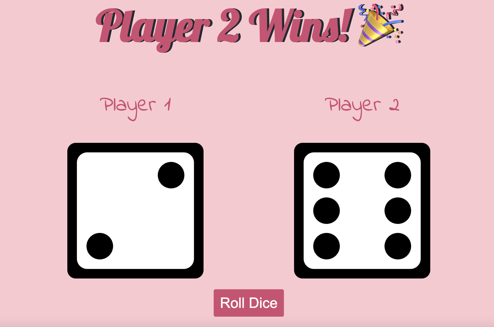

# dice-game

## Description
This game was created for anyone interested in a dice game. 

## Usage
Open the website link in your browser or mobile device and click the button to begin the game. This game was made for two players. Each of the players decides whether they want to be player 1 or 2. Once the button is clicked, the dice face will change and the website will indicate which player won or if there is a tie. 

Website link: https://lilym036.github.io/dice-game/

## License
None at this time. 